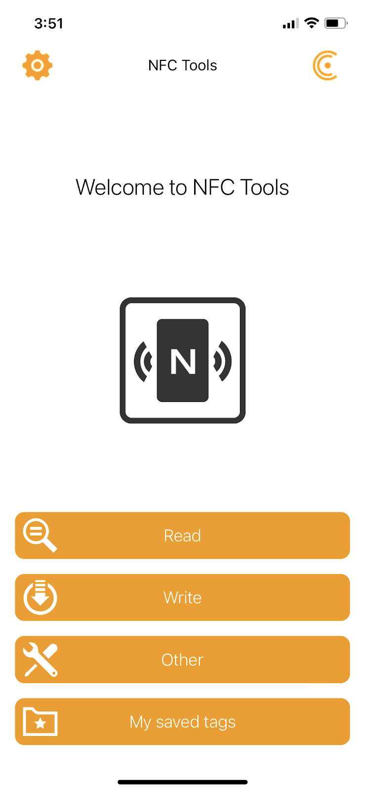
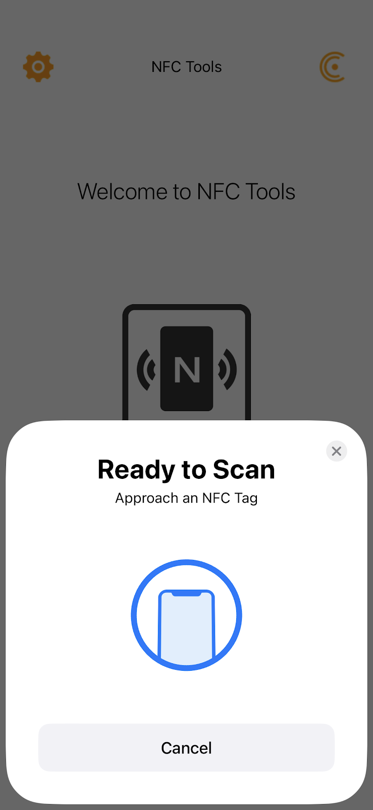
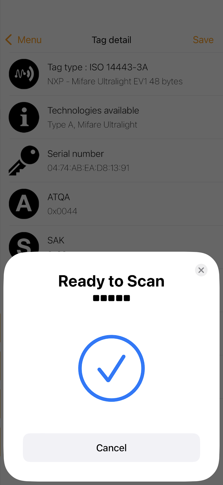
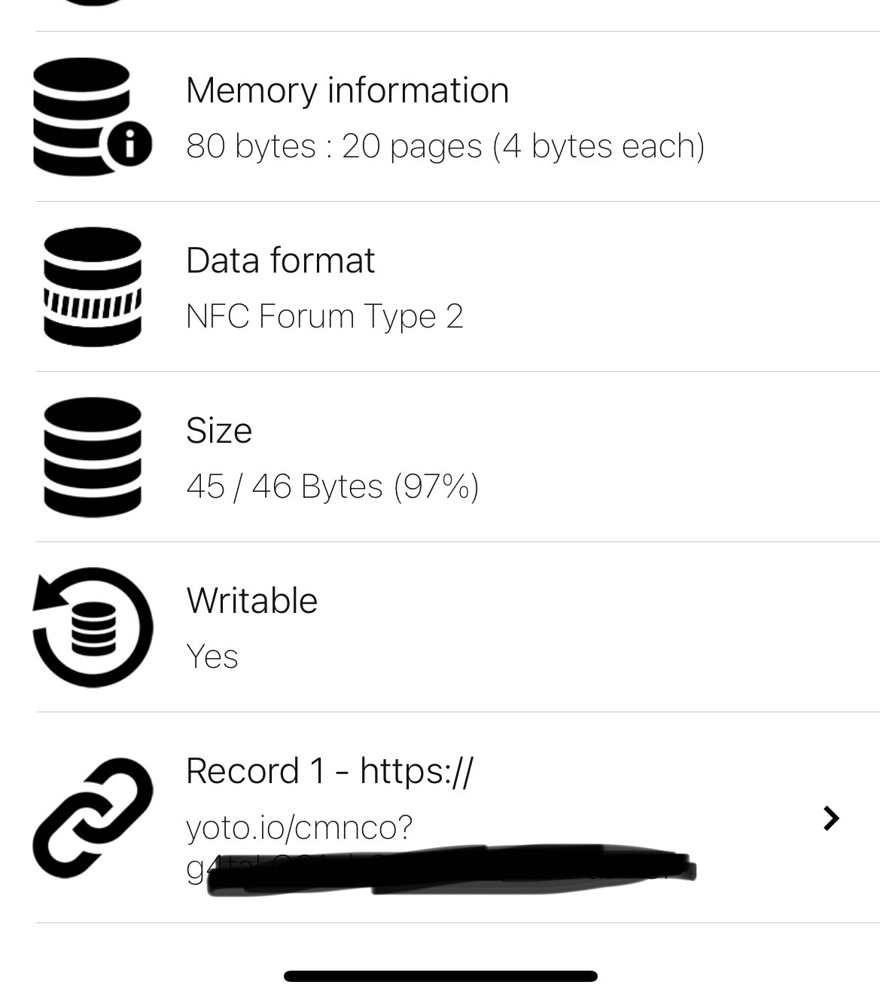
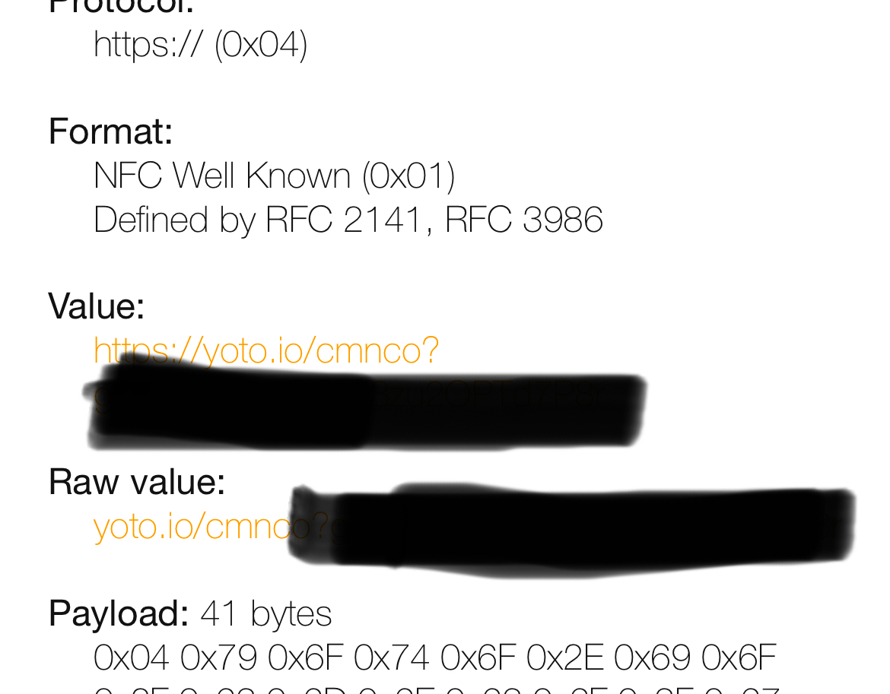

# Scanning Just a Few Cards (iOS and Android)

If you only have a few cards you scan, this method will be the simplest. Its entirely manual (no automation), but it also is FREE and only takes 1-2 minutes per card. This is a great thing to multitask while binging the latest season of junk TV that is your guilty pleasure. It’s OK, we all have 1. Or 5. Or 20….

## Using NFC Tools

- [iOS - NFC Tools](https://apps.apple.com/us/app/nfc-tools/id1252962749)
- [Android - NFC Tools](https://play.google.com/store/apps/details?id=com.wakdev.wdnfc&hl=en-US)

Directions:

1. Launch the app
2. Tap on “Read”

3. A window will pop up asking you to scan the card

4. Tap your card to the phone to scan it
- Wait for the checkmark or error and the window to disappear, the app needs to read all the data off the card
- Sometimes the card will scan but not all the data will be read from it

5. Scroll down and find “Record 1”, if you don’t see it, go back and scan the card again

6. Copy either the `Value` or `Raw Value` field to your clipboard, usually that means a long-press and then click “Copy Link”

7. Open the [survey link](https://forms.gle/evmKzarnhkK7efYq6) to the Submission Portal on your phone
8. Paste the link into the survey and hit submit.
9. The archive team will handle the rest.
