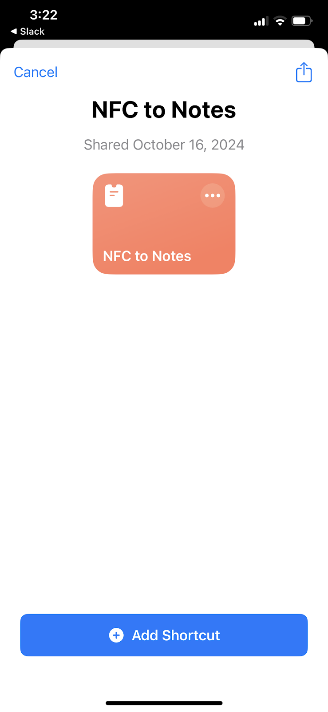
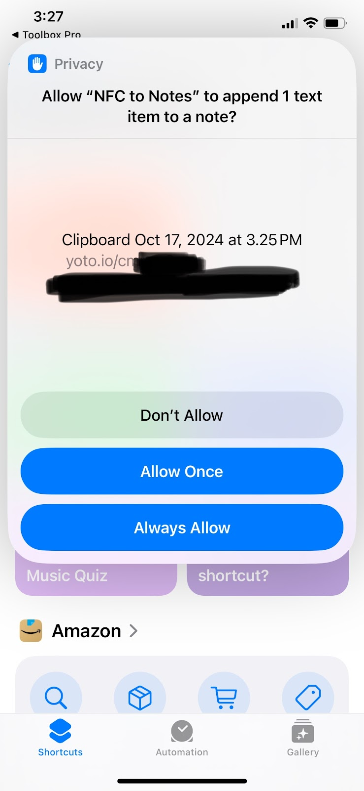

# Scanning Lots of Cards (iOS)

Do you have a lot of cards you want to scan? These instructions will help you set up a Shortcut using a premium app ($5.99 USD). Think of it like buying one more card to ensure you can safely backup all your cards, not to mention the app purchase also lets you get all kinds of other Shortcut tools that you can use for anything else your heart desires.

## How it Works

1. The shortcut pops a window asking you to scan a card
2. It will copy the link off the card to the clipboard then paste it into the Note that you selected; text is always appended to the end of the note
3. When complete, it will open the Yoto app again so you can move to the next card quickly

## Setup
1. Download an app called [Toolbox Pro for Shortcuts+](https://apps.apple.com/us/app/toolbox-pro-for-shortcuts/id1476205977) (click the link on your phone)

2. Launch the Toolbox Pro app
3. Enter the settings inside the app (bottom right icon)
4. Purchase the “Toolbox Pro Premium” license ($5.99 USD)
	- Tip: Try clicking the “Restore Purchases” button first.If you’ve already purchased this item it will be restored.
5. Finish the purchase and go back to the Home screen when you’re done
6. Open the Notes app
7. Create a new note, title it “My Yoto Cards”
8. Open [this link (from your iphone) to get the pre-made Shortcut](https://www.icloud.com/shortcuts/08c78b2c3e2a40c196aa241521f8f2d2)
9. Click “Add Shortcut”

10. Open the Shortcuts app (if its not already open)
11. Click the Shortcuts menu item in the bottom left
12. Tap the menu icon (3 dots) on the “NFC to Notes” shortcut
13. Find the action that says “Append Clipboard to Yoto Cards”, tap on the text “Yoto Cards”

14. A list of your Notes files should show up, tap on the note you created titled “My Yoto Cards”. The text inside the action block should change to “My Yoto Cards” now
15. Click “Done” in the top right corner
16. Tap the shortcut card to run it. It will ask for permission to do each of the things that it does; you need to grant permission for the shortcut to do all these things or it won’t work.
	- Allow NFC to Notes to access TOolbox Pro - Allow
	- A slider will show up asking you to scan a card, scan a card
		- If you don’t already have a license to the Toolbox Pro app, it will tell you that it needs features in that app. 
		- If you have the license, it will just work.
		- It should pop up a little slider window asking you to scan a card, that’s how you know it is working.
	- Allow NFC to Notes to share 1 text item with Toolbox Pro? - Always Allow
	- Allow NFC to Notes to copy 1 text item to the clipboard? - Always Allow
	- Allow NFC to Notes to append 1 text item to a note? - Always Allow

17. When the task is complete, the shortcut launches the Yoto app, this will return you to the screen you were previously on which is very useful when scanning multiple cards

## How to Use it (from the Yoto App)

1. Get a MYO card that you can wipe, a lot of times
2. Go into the Yoto app
3. Select the target card
4. Click “Link to Card”
5. Scan the MYO card. (See [Tips for scanning MYO cards with your phone](tips_for_scanning_myo_cards_with_your_phone.md)
6. Open the Shortcuts app
7. Tap the NFC to Notes shortcut to run it
8. Wait for the prompt to scan the card, tap the card to the phone to scan it
9. Wait for the screens to switch back a few times
10. The Yoto app will be opened when the task is complete
11. Repeat with the next card you want to scan

## How to Use it (for physical cards)

1. Get the stack of cards you want to scan
2. Open the Shortcuts app
3. Tap the NFC to Notes shortcut to run it
4. Wait for the prompt to scan the card, tap the card to the phone to scan it
5. Wait for the screens to switch back a few times
6. Note: The Yoto app will be opened when the task is complete. It may be useful to edit the Shortcut and simply delete this last action if you are scanning a stack of physical cards. 

## When Done Scanning….

1. Open your My Yoto Cards note and copy all the text out of it.
2. Open the [survey link](https://forms.gle/evmKzarnhkK7efYq6) to the `Submission Portal` on your phone
3. Paste the links into the survey and hit submit.
4. The archive team will handle the rest.
