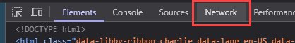
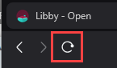
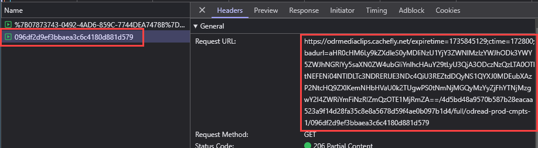
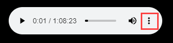
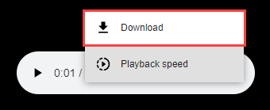

# Libby MP3s

Requirements:

- Chrome or a Chromium-based browser

*This method requires no additional setup (nothing to download or run), though is a bit more cumbersome for longer audiobooks.*

---

1. Open the Audiobook player in the Libby app ([https://libbyapp.com/](https://libbyapp.com/))
2. Right click, and click on Inspect
    
    
    
3. Click on Network
    
    
    
4. Click on Media
    
    
    
5. Refresh the page
    
    
    
6. Select the last media file and copy the Request URL:
    
    
    
7. Paste the URL in a new tab. This will open the mp3, which can then be downloaded.
    
    
    
    
    

---

If an audiobook has multiple parts (typically if it is longer than ~1.25 hours), then there are a few more steps to get the additional parts (see below). Or try the [Overdrive method](using_libbyoverdrive_odmpy.md).

Also, a variation of this retrieval method can be used, but instead of inspecting the page yourself, you can use the Video Download Helper to acquire the mp3 (see the [Video Download Helper guide](using_video_download_helper_for_myo.md) for more information). Please note if you use this method you cannot use Chrome.

Additional Steps for Multi-Part Books (on Libby)
---
1. After downloading the first part, navigate to the each subsequent part of the book.

2. Repeat steps 5-7 above for each subsequent part.

*Tips to make this easier:*

- *Reference the last file downloaded for duration and use the Libby audioplayer Table of Contents to figure out where you need to jump for the next part.*
- *Start playing the file prior to downloading to make sure it is the correct part.*