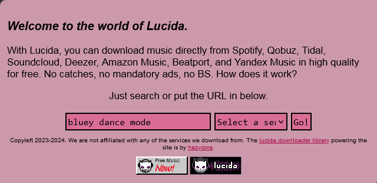
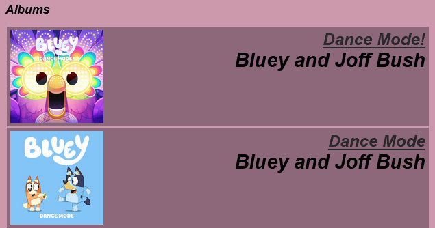
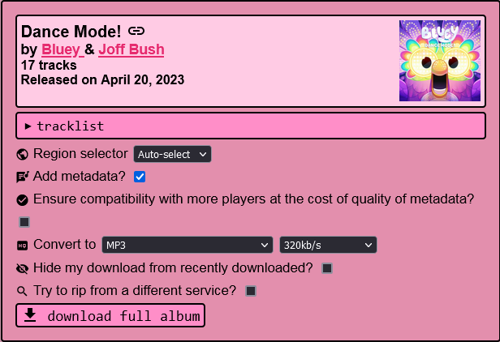
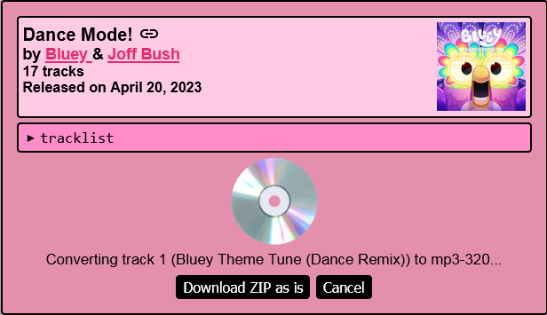
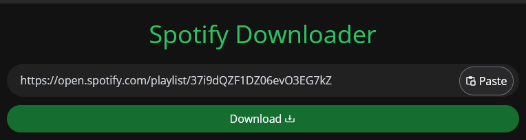
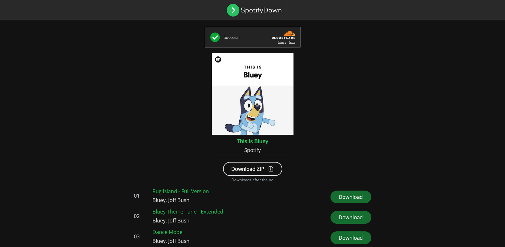

# Spotify for MYO

Author: [u/playchime](https://www.reddit.com/u/playchime)

Spotify is a great source for MYO audio, as the audio should be in higher quality than YouTube, and doesn’t require being converted from video format. When it comes to downloading audio from Spotify, the best option I have found so far is to use Lucida.to (which also supports several other music streaming websites). 

## Lucida

[Lucida.to](https://lucida.to) is a simple to use audio ripper that works in your internet browser (computer or mobile). You can give it the direct link to a song or album if you already have it on hand, or you can just type the name of the artist or album into the search. It pulls up individual songs first–if you want to download a whole album at once, just scroll past those and the albums will be at the bottom of the search results. Once you’ve selected what you want to download, it will give you different options for the quality of the audio. You’re looking for 320kbps MP3 (you can also use lower quality MP3s for MYO if you prefer. I don’t know all the technical aspects of any limitations Yoto might put on the audio output, so I can’t say for sure highest quality makes a difference. It’s rare to run into the size limit on a playlist before hitting the track limit though, so I always like to start with the highest quality just in case).

If you’re downloading a whole album at once*, it will provide you with a .zip file, which is all the MP3s of the album condensed into one file for easier downloading. You will need to “unzip” it using the file extractor on your computer. Mac users are on their own here, as I do not have any familiarity with Mac, but for Windows you need to opposite-click the .zip file to bring up the context menu and select “extract all” which will make you a folder containing all of the MP3s you downloaded, which can then be uploaded to a MYO playlist using the in-browser [My Yoto website](https://my.yotoplay.com/), which will sync to your phone for actual card linking.  

*Please note I have not tested whole-album downloading on mobile. I am not sure if this works due to the ZIP files.  

Start by opening up Lucida, and pasting in your URL or typing out your search query:

I’ve decided to do a search for the Bluey album “Dance Mode”. You now need to select a service to source the audio from. It doesn’t actually have to be Spotify. Deezer is an excellent first choice, especially for mainstream/commercial music. Amazon Music should work as well, but I haven’t tested it yet.

You can see here I chose Deezer:

It also automatically filled in the last menu for me, which is an option of the server you will be downloading the audio from. You can pick any option here, it does not need to be the one that matches your country. 

You can now press “Go!” to get your search results:

As you can see I’ve turned up individual songs first. I’m not interested in those, I’d like the whole album, so I’ll scroll down to the bottom:

It’s actually found two Bluey Dance Mode albums. Not sure what that’s about but it’s the first one I’m looking for, so I’ll click the title of it to go to the download page:

Here’s where Lucida starts to get visually overwhelming for people who aren’t very tech-confident! Haha. Don’t worry though, you don’t need most of this. All you need to do is make sure the “Convert to” dropdown says “MP3” (you can choose whatever quality you like next to that, but 320kbps is the best one), and then you can press “download full album” to start the download process.

It will now start downloading and converting each track one by one, so you’ll have to be a little patient! It doesn’t take very long. The “Download ZIP as is” button will stop the process and download only the tracks it’s managed to grab so far, so we don’t want to use that one.

Sometimes it will run into an error while grabbing the tracks:

If you just press “Retry” a few times, it’ll usually get it. Otherwise you can choose to skip the troublesome track, and just come back and download it individually after.

I actually don’t need this Bluey album so I don’t want to waste the site’s resources right now downloading the whole thing. I’ll come back and add what it looks like when it’s done and gives you the final download button shortly when I need to grab another album!

## SpotifyDown

[SpotifyDown](https://spotifydown.com/) is also a simple to use audio ripper for browsers, even more simple than Lucida. You can give it a direct link to a song, album or playlist and it will provide a list of MP3 downloads, or the option to download all the tracks at once. I would recommend people with minimal tech confidence use SpotifyDown over Lucida due to the simpler interface, however I believe SpotifyDown is likely less reliable in the quality of the MP3s it provides and also could potentially result in content mis-matches, so please listen to any audio you download with it before adding it to your Yoto to check if it’s correct and you’re happy with the quality. TLDR it’s a lower-quality tool than Lucida, but the trade-off is ease of use.

Start by grabbing the sharing link of the album or playlist you want to download. It is located under the menu of three dots:
  

Then [open up the SpotifyDown website](https://spotifydown.com/) and paste the link into the bar provided:

Press “Download”, and you should be brought to a second screen showing a list of the songs on the album or playlist:

From here you can either download them individually with the download button to the right of each track, or use the big “Download ZIP” button to download all of the tracks at once in a zipped folder. Either way, save them in a place you’ll know where to find them!