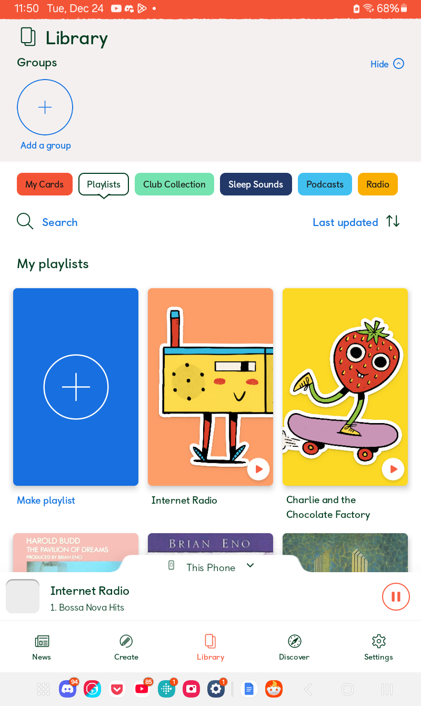
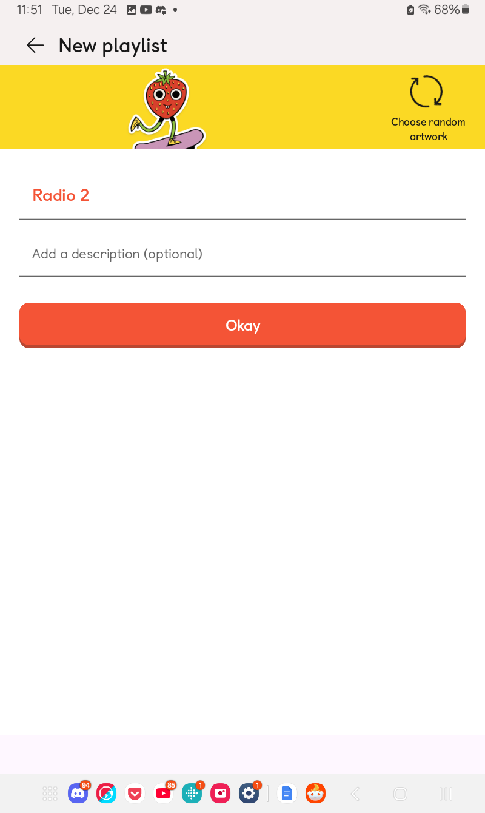
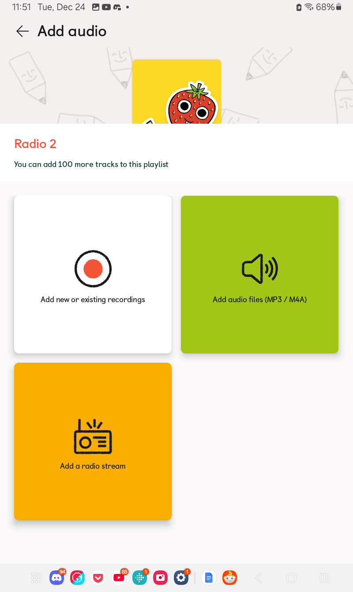
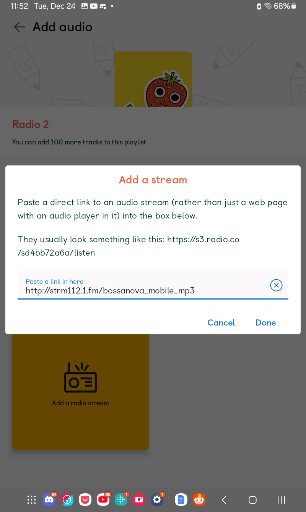
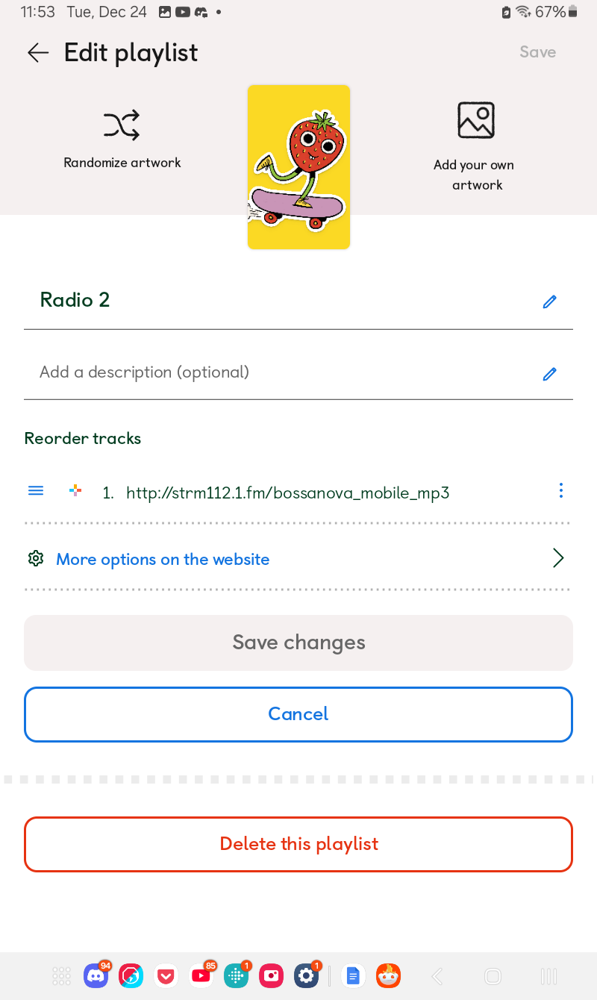
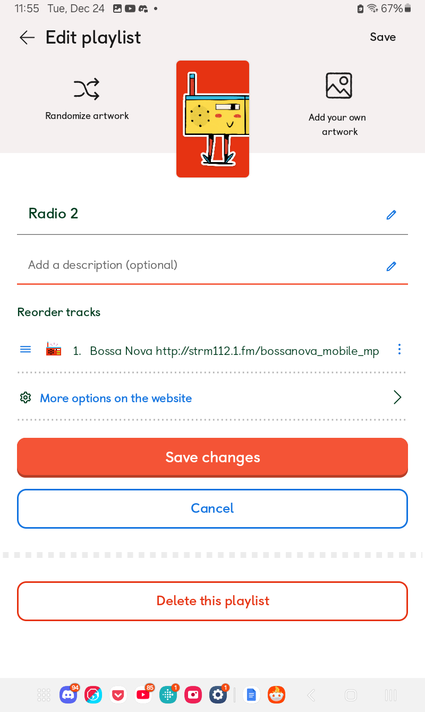

# Radio Stations Setup - Using the App

Author: [u/playchime](https://www.reddit.com/u/playchime)

We’ll start by opening the app and navigating to the Playlists section by using the row of coloured tabs, just like we do when making a playlist of MP3s:

As you can see I’ve already got a radio card, but we’re going to pretend I don’t and start by pressing the big blue button to start a new playlist. I’ve chosen to name my playlist Radio 2:

Now we’ll want to select the large yellow button for radio:

Which will prompt us to add a radio streaming link:

I’ve chosen to add a bossa nova station, as that’s one of my favourite genres. But you’ll probably be adding kids music to yours ([this page](yoto_radio_stations.md) has some to check out).

Once we hit done the app does that annoying thing again where it exits the editing menu, so we’ll need to press the pencil button at the top right to open it again.

Here you can do all of the usual things like change the artwork, add an icon, or change the track name. I like to keep the URL in the name though as once you’ve removed it from the title Yoto has no way that I’ve found to be able to copy that link again, so if you want it to add to another playlist or give to a friend, you’ll have to source it all over again if you remove it.

Here you can see how I've named mine:

If you want to add another station to the same card, you now need to press “Save Changes” to go back to the previous menu

From here you can press “Add Audio” and go through the process again to add a second station, and then however many more as you'd like after that!  

You can add up to 100 stations on one card, or you can even add them to a card that also has normal, MP3 audio. Please note however that in order to use radio on your Yoto, it must be connected to wifi. There is no way to have the radio saved to the internal memory. However if you have wifi on your phone, you can use it to cast the radio to the Yoto using the Yoto as a bluetooth speaker, in situations where the Yoto itself doesn't have wifi access but your phone still does.