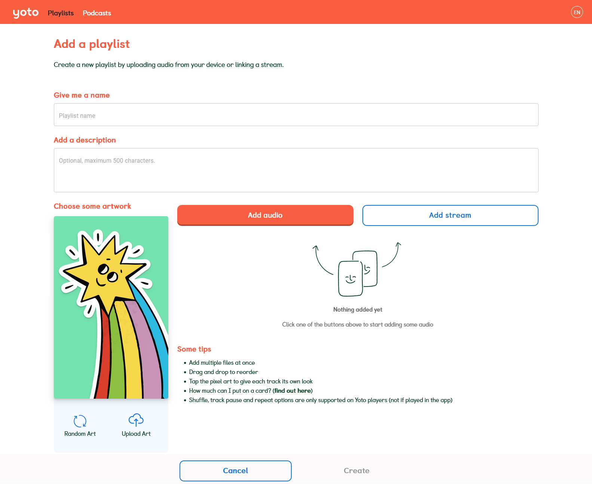
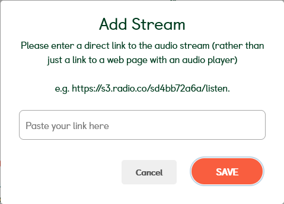

# Radio Stations Setup - Using a Computer

We will start by once again going to our [My Yoto website](https://my.yotoplay.com/) in your web browser of choice

As you can see I’ve already got a radio card set up, but we’ll continue as if I don’t by pressing the big blue “Add Playlist” button.
  

Here is the familiar playlist screen again! This time we will select “Add Stream”, which makes a pop-up that looks like this:

Simply paste your link, and press “SAVE”. The link will then be shown as a regular MYO track in your playlist.  

As you can see here from the URL, I’ve added a Bossa Nova station, as that’s one of my favourite genres of music:
  

You can then add an icon as usual, and also click where the URL is to name the track–I like to keep the URL in the name though as once you’ve removed it from the title Yoto has no way that I’ve found to be able to copy that link again, so if you want it to add to another playlist or give to a friend, you’ll have to source it all over again if you remove it.

I find something like this is best. Still giving a name but leaving the URL information alongside it in case I need it again.

You can add up to 100 stations on one card, or you can even add them to a card that also has normal, MP3 audio. Please note however that in order to use radio on your Yoto, it must be connected to wifi. There is no way to have the radio saved to the internal memory. However if you have wifi on your phone, you can use it to cast the radio to the Yoto using the Yoto as a bluetooth speaker, in situations where the Yoto itself doesn't have wifi access but your phone still does.